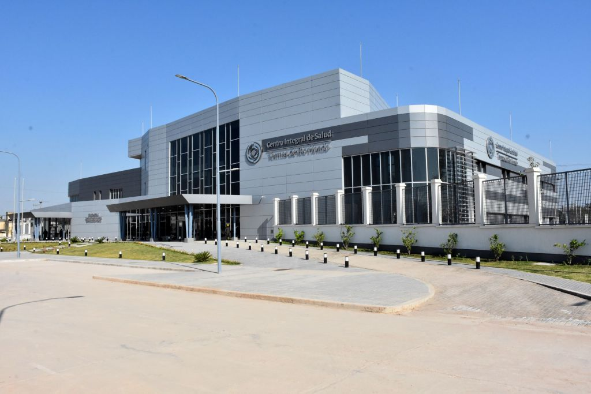

# CIS Termas de Río Hondo
**Integrated Health Center | 5,700 m²**

**Role:** Technical coordination and construction management for this high-complexity healthcare facility.
* Managed medical-grade technical specifications.
* Oversaw site inspections and material quality control.
