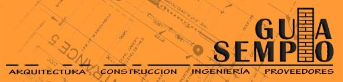
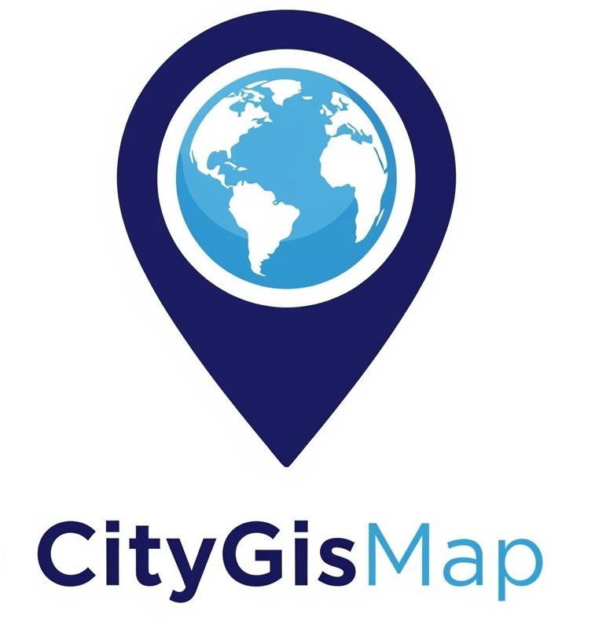
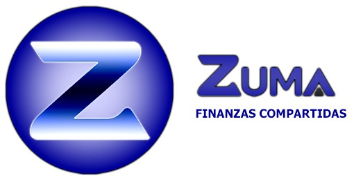

# Tech Developments

As a developer, I create tools that solve real-world industry problems by combining technical precision with intuitive design.

**🛠️ Guia Sempio**

The Construction Connection

A comprehensive directory connecting construction professionals with specialized suppliers. It streamlines procurement and networking within the local building industry.

**🗺️ CityGisMap**

Urban Intelligence

A GIS-based map solution for urban planning and data analysis. Designed to help municipalities manage territories through georeferenced data and interactive visualization.

**💳 Zuma - Finanzas Compartidas**

Collaborative Fintech

A fintech-oriented platform for managing shared finances. It provides transparency and efficiency for teams operating in collaborative project environments.

<i>Interested in a technical breakdown? Feel free to reach out.</i>

