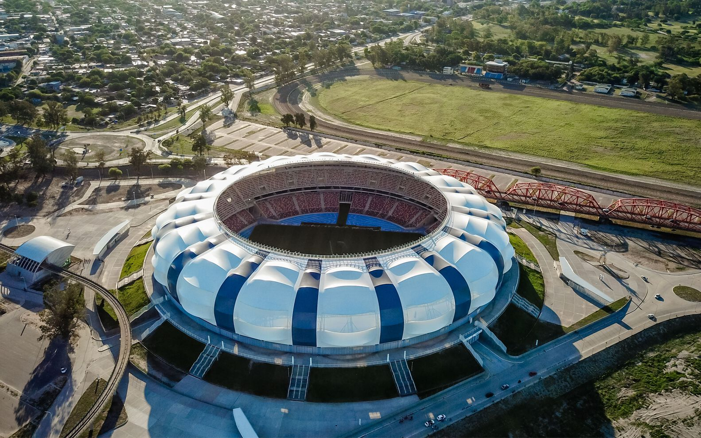

# Estadio Único Madre de Ciudades
**International Sports Infrastructure | 28,000 m²**

### Project Overview
A landmark project in Santiago del Estero, this FIFA-grade stadium was designed to meet the highest international standards for sports and entertainment.

### Role: Construction Management & Control (CDG)
Working with **MIJOVI SRL**, I was responsible for the analytical management and technical oversight of this large-scale project.

**Key Contributions:**
* **Technical Analysis:** Evaluated complex structural systems and specialized construction materials.
* **Management & Control:** Monitored project timelines and budget execution to ensure compliance with provincial and international regulations.
* **Document Control:** Managed a high volume of technical blueprints and specifications, ensuring seamless communication between engineering teams and on-site execution.
* **Quality Assurance:** Oversaw the application of high-tech finishes and sports-specific infrastructure (lighting, turf management, and safety protocols).
